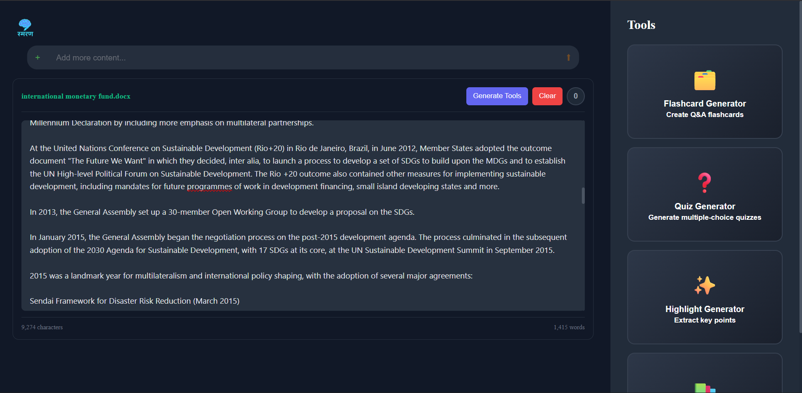
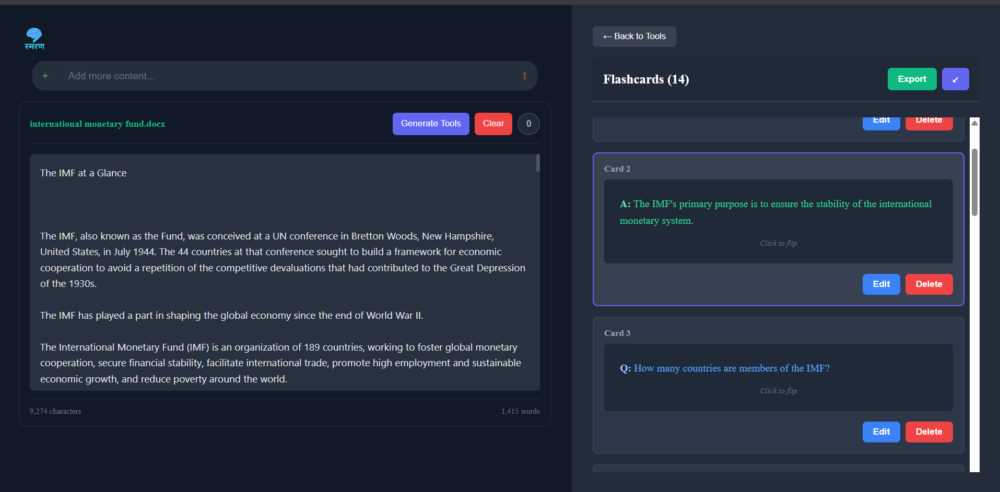
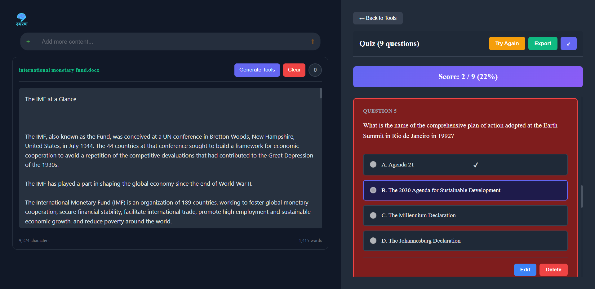
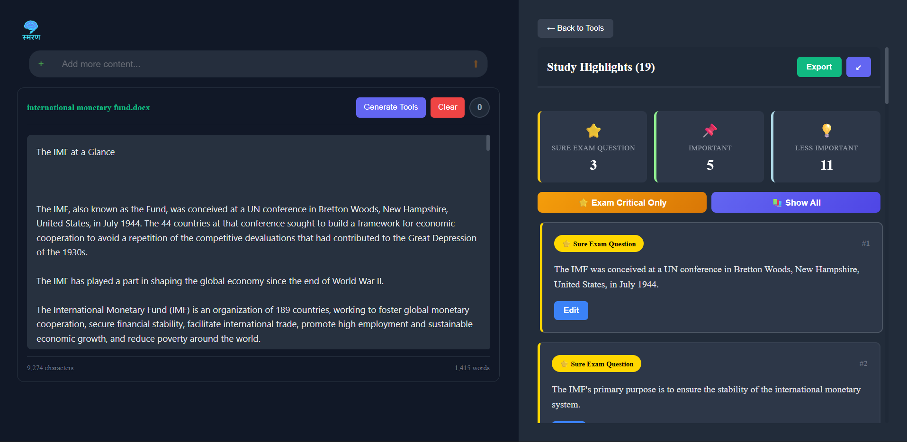
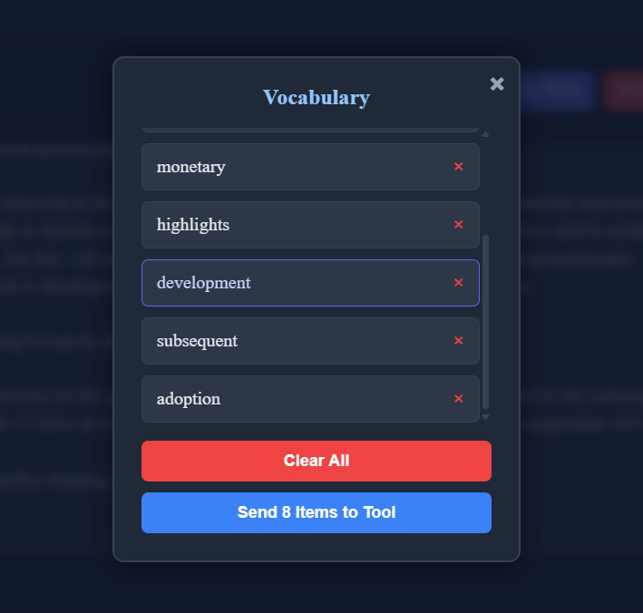
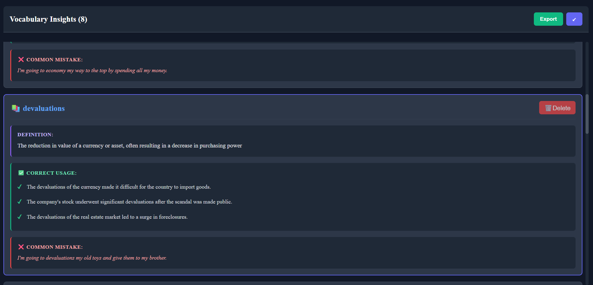

<div align="center">


 Ismaran

**Transform any document into a complete study session — instantly.**

[](https://recallify-341u-5itodvpct-gobler-codes-projects.vercel.app/)
[](https://github.com/Gobler-code/Recallify)
[](https://react.dev/)
[](https://vitejs.dev/)

</div>

## 🎯 What is Ismaran?

Ismaran is an AI-powered study tool that turns your PDFs, images, and notes into interactive learning materials in seconds. Upload a document and instantly get:

- ✅ Flashcards with Q&A pairs
- ✅ Multiple-choice quizzes with instant scoring
- ✅ Smart highlights categorized by exam importance
- ✅ Vocabulary cards with definitions and usage examples

No more manually making study cards. Just upload and learn.

(**→ [Try it live](https://recallify-341u-5itodvpct-gobler-codes-projects.vercel.app/)**)

---
## 📸 Demo

### 1️⃣ Initial State


### 2️⃣ Flashcards


### 3️⃣ Quiz


### 4️⃣ Smart Highlights


### 5️⃣ Vocabulary Box


### 6️⃣ Vocabulary Insights


---

## ✨ Features

### 📄 Document Processing
- Upload **PDFs, Word documents, and images** (JPG, PNG)
- Paste raw text directly
- Review and edit extracted content before generating
- Select difficult words to build a custom vocabulary list

### 🧠 AI Study Tools

| Tool | What it does |
|------|-------------|
| **Flashcards** | Auto-generates Q&A pairs; flip, edit, delete, export |
| **Quiz** | Multiple-choice questions with instant feedback and score tracking |
| **Smart Highlights** | Key sentences color-coded by importance (Exam Critical / Important / Good to Know) |
| **Vocabulary** | Definitions + correct & incorrect usage examples for selected words |

### 📤 Export
- Export Flashcards, Quizzes, Highlights, and Vocabulary as **text files**
- Download anytime for offline study

### 🎨 UI & Experience
- Dark theme optimized for long study sessions
- Responsive layout for desktop and tablet
- Smooth animations and expandable tool panels

---

## 🛠️ Tech Stack

| Category | Technology |
|----------|-----------|
| Frontend | React 18, Vite, CSS3 |
| AI / LLM | Groq (Llama 3.3 70B) |
| File Processing | pdf.js, Tesseract.js, Mammoth.js |
| Deployment | Vercel |

> **AI Engine:** Powered by Groq's Llama 3.3 70B — chosen for its speed, generous free tier, and strong instruction-following for structured JSON output across all study tools (flashcards, quizzes, highlights, vocabulary).

---

## 🚀 Getting Started

### Prerequisites
- Node.js 18+
- A free Groq API key

### Installation

```bash
# Clone the repo
git clone https://github.com/Gobler-code/Ismaran.git
cd Ismaran

# Install dependencies
npm install
```

### Environment Setup

Create a `.env` file in the root directory:

```env
VITE_GROQ_API_KEY=your_groq_key_here
```

Get your free API key:
- **Groq** → [console.groq.com](https://console.groq.com) — no credit card required

### Run Locally

```bash
npm run dev
```

Open [http://localhost:5173](http://localhost:5173) in your browser.

---

## 📁 Project Structure

```
Ismaran/
├── src/
│   ├── components/
│   │   ├── LeftSection/
│   │   │   ├── LeftSection.jsx       # Document upload & text extraction
│   │   │   ├── EditableDocument.jsx  # Extracted text editor
│   │   │   └── VocabManager.jsx      # Word selection for vocabulary
│   │   └── RightSection/
│   │       ├── RightSection.jsx      # Tool panel container
│   │       ├── FlashcardTool.jsx     # Flashcard generator & viewer
│   │       ├── QuizTool.jsx          # Quiz generator & scorer
│   │       ├── HighlightTool.jsx     # Smart highlight extractor
│   │       └── VocabTool.jsx         # Vocabulary card generator
│   └── services/
│       └── geminiService.js          # Groq API integration
├── public/
├── index.html
└── vite.config.js
```

---

## 🗺️ Roadmap

**v1.1 — Current**
- [x] PDF, Word, and image text extraction
- [x] Flashcard and quiz generation
- [x] Smart highlights with importance categories
- [x] Vocabulary tool with usage examples

**v1.2 — Planned**
- [ ] Spaced repetition system for smarter review
- [ ] Study session analytics and performance tracking
- [ ] Summary and mind map generators
- [ ] Export to PDF / Anki format

**v2.0 — Future**
- [ ] User accounts and cloud sync
- [ ] Collaborative study rooms
- [ ] Mobile app (React Native)
- [ ] Multi-language support

---

## 👨‍💻 Author

**Uparjan Gautam**
- GitHub: [@Gobler-code](https://github.com/Gobler-code)

---

## 🙏 Acknowledgments

- [Groq](https://groq.com/) — AI-powered content generation (Llama 3.3 70B)
- [pdf.js](https://mozilla.github.io/pdf.js/) — PDF text extraction
- [Tesseract.js](https://tesseract.projectnaptha.com/) — Image OCR
- [Mammoth.js](https://github.com/mwilliamson/mammoth.js) — Word document processing

---

<div align="center">

Made with ❤️ for students everywhere · ⭐ Star this repo if it helped you!

</div>
